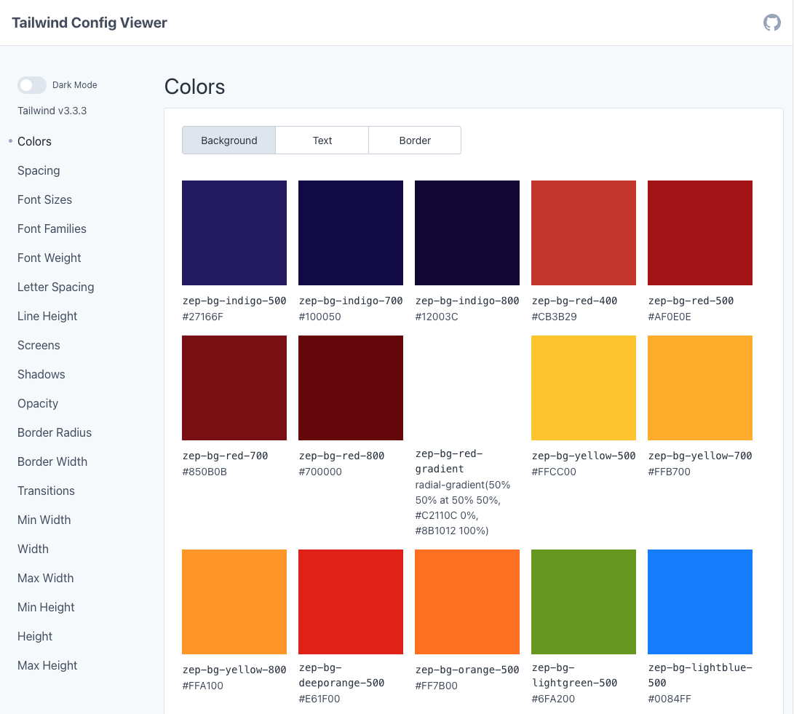

# Zeppelin - Design System React Component Library

This component library is a collection of React components that can be used to build the UI for React based Zeppelin web applications.
It's written in Typescript and is compatible with [Next.js 13](https://nextjs.org/) using the [App Router](https://nextjs.org/docs/app) as well as pure React applications. It can be consumed by Javascript and Typescript applications.

The component designs are based on design tokens (source: [Figma Design System files](https://www.figma.com/files/1210548278352940643/project/83349826/Design-System?fuid=1202165791388993328)), that are available as a [tailwindcss preset](https://tailwindcss.com/docs/presets) in our [figma-design-tokens package](https://github.com/zepdev/figma-design-tokens)

## Getting started

Before package installation, make sure to create an .npmrc file to get access to private npm packages inside our zepdev github organisation.

### Tailwind CSS

While this component library uses [tailwindcss](https://tailwindcss.com/), it is not necessary to configure consuming applications to use tailwindcss. This library provides a styles.css file with all component styles, that can be imported into your application code.

Nevertheless we recommend to set up your consuming application with tailwindcss and our [figma-design-tokens package](https://github.com/zepdev/figma-design-tokens) as well, to make use of our design-tokens as tailwind utility-classes in your whole application and to take advantage of the built in treeshaking for an even smaller CSS filesize. To do so, please follow the instructions provided by the [figma-design-tokens README.md](https://github.com/zepdev/figma-design-tokens)

For contributers it's recommended to install a tailwindcss plugin for your IDE/Editor to enhance the Tailwind development experience by providing advanced features such as autocomplete, syntax highlighting, and linting.

Plugin download links:
VSCode: [Tailwind CSS IntelliSense](https://marketplace.visualstudio.com/items?itemName=bradlc.vscode-tailwindcss)

JetBrains IDE's: [Tailwind CSS](https://plugins.jetbrains.com/plugin/15321-tailwind-css)

### Create .npmrc File to use private packages.

Create a personal access token (PAT) on GitHub with `write packages permissions`

Create `.npmrc` file in your project root, with the following content and place your PAT to it, without the square brackets.

```
progress=true
@zepdev:registry=https://npm.pkg.github.com/
//npm.pkg.github.com/:_authToken=[place github token here]
```

### Install package

```bash
npm i @zepdev/design-system-component-library-react

# or

yarn add @zepdev/design-system-component-library-react

# or

pnpm add @zepdev/design-system-component-library-react
```

#### peerDependencies

Please make sure to meet this library's peerDependencies and node version requirement inside your application.

## Usage

Import any component from this library into your application like this:

```typescript
// Example.tsx

import { Button } from '@zepdev/design-system-component-library-react';

export default function Example() {
  return (
    <div>
      <p>This is an example of how to use a button from the Design System Component Library</p>
      <Button variant="primary" label="Click me" />
    </div>
  );
}
```

### Projects without tailwindcss setup

Projects without tailwindcss setup that consume the design tokens as previously mentioned in [Tailwind CSS](#tailwind-css) must import the `styles.css` file with all relevant CSS classes and custom properties to get the appropriate component styles.

(e.g. import directly to your global `layout.tsx`)

```typescript
// layout.tsx

import '@zepdev/design-system-component-library-react/dist/styles.css';
```

## Storybook

For complete documentation of the components, please refer to our [Storybook](https://zepdev.github.io/design-system-component-library-react-gh-pages).

## Design Tokens documentation

At the moment, we do not have proper design token documentation. Until we make this available in a holistic design systems documentation tool (e.g. [supernova](https://www.supernova.io/)), we provide a number of alternative separate resources to learn more about the structure and use of design tokens in code:

- technical overview: [Design Tokens (Miro)](https://miro.com/app/board/uXjVMOhK9oU=/?share_link_id=139071631495)
- source code: [figma-design-tokens (Github)](https://github.com/zepdev/figma-design-tokens)
- source design: [Design System/Foundations (Figma)](https://www.figma.com/file/Odjx7KemWzgZDpr5jGoQu2/Foundations?type=design&t=UMTOhqY6fkKk7gxw-6)

### Visualize your tailwindcss config with Tailwind Config Viewer

In addition to the resources mentioned above, [tailwind-config-viewer](https://github.com/rogden/tailwind-config-viewer) allows to visualize the tailwind configuration.
This visualization does not map the full range of the tokens and extensions in our tailwindcss preset but it does provide insight into a variety of utility classes and their values that we generate from our core tokens layer. In conjunction with the tailwindcss documentation this helps especially beginners to get an overview of how these utility classes are built and which of our design tokens are now underlying them.

Follow the instructions from their [documentation on github](https://github.com/rogden/tailwind-config-viewer) to do it inside your project.



# Contribution

## Initial Setup

```bash
yarn install
```

### Compile and minify for production

```bash
yarn build
```

## Storybook

Run it locally:

```bash
yarn storybook
```

Build it:

```bash
yarn build-storybook
```

Preview the production Storybook after local build:

```bash
npx http-server storybook-static
```

We are deploying the storybook to github pages. This is done by our CI/CD process, it builds the storybook and pushes it to another repo. The preview for develop branch is available at <https://zepdev.github.io/design-system-component-library-react-gh-pages-develop/> and the production ready components from our main branch can be viewed at <https://zepdev.github.io/design-system-component-library-react-gh-pages>

## Lint code

```bash
yarn lint
```

## Prettier

If you are using VSCode, you can add the following to your settings.json file:

```bash
{
  "prettier.configPath": ".prettierrc.json",
  "editor.defaultFormatter": "esbenp.prettier-vscode",
  "editor.formatOnSave": true
}

```

Now, whenever you make changes to a file and save it you should notice that Prettier auto formats it for you if needed.

Use the prettier script to format all files at once:

```bash
yarn prettier
```

## (Peer) Dependencies

All dependencies are managed by yarn. New dependencies that are not dev dependencies and should not be bundled into the library should be added as peer dependencies. This is to ensure that the consuming application is responsible for the version of the dependency.

### Design Tokens dependency

**Please make sure to always use the exact version of the @zepdev/figma-design-token package as a peer dependency.**

To update it's recommended to change the version number in the package.json and run an install with `yarn`

## Tests

We run several types of tests through our CI Pipeline to ensure the creation of a robust component library and to detect quality issues before a new version is released.

### unit tests

We use [Jest](https://jestjs.io/) and [React Testing Library](https://testing-library.com/docs/react-testing-library/intro/) which come with Vitest for testing React components.

#### run all unit tests

```bash
yarn test
```

### UI Visual Regression Tests

We use [Chromatic](https://www.chromatic.com/) for visual regression testing and as part of our manual UI review process. We also configured [Story Modes](https://www.chromatic.com/docs/modes) to test different viewport, theme and background scenarios. For more info about Chromatic, please check the [Chromatic documentation](https://www.chromatic.com/docs/).
To run the tests from your local machine (not recommended), you need to install the [Chromatic CLI](https://www.chromatic.com/docs/cli) and run the following command:

```bash
npx chromatic --project-token 8c8b4dcb0ddf
```

### Interaction Tests

We configured Storybook to run interaction tests. They will run on Chromatic together with the Visual Regression Tests on every pull request.
Please refer to [Storybooks Interaction test documentation](https://storybook.js.org/docs/react/writing-tests/interaction-testing) on how to write these tests.
You can trigger these tests locally via Storybook test-runner (will run together with [Accesibility Tests](#accessibility-tests)):

```bash
yarn test-storybook
```

### Accessibility tests

We configured storybook to enable accessibility checks for your stories with their [a11y addon](https://storybook.js.org/addons/@storybook/addon-a11y) powered by axe-core.
It provides an accessibility panel in the Storybook where you can inspect the results of the tests.

Additionally we configured the Storybook test runner to automate accessibility tests.
Currently they are not part of our CI/CD pipeline, but can be run locally via Storybook test-runner (will run together with [Interaction Tests](#interaction-tests)):

```bash
yarn test-storybook
```
